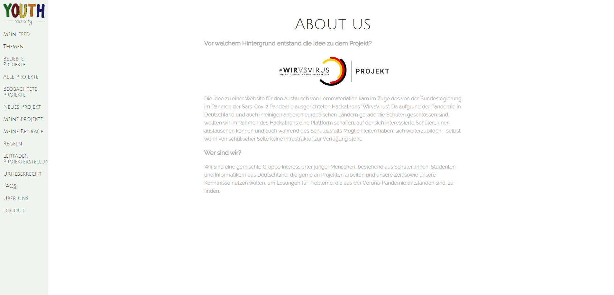

# Youthversity


Eine Onlineplattform für Schüler zur Erstellung und dem gegenseitigen Austausch von Projekten.

Entstanden im Rahmen von:


You can find this project in the context of the #WirVsVirus Hackathon on [Devpost](https://devpost.com/software/1_019_e-learning_youthversity-youthversity).

### Impressions

[](https://github.com/caschnu/youthversity/tree/master/docs/screenshots)

[Video: 1 Minute Trailer](https://www.youtube.com/watch?v=-qSeloGiVcY&feature=youtu.be)

[Video: Walkthrough and Desgin](https://www.youtube.com/watch?v=oscJrktk2bE)


### Installation

The project is build with python3 and django. For set up in your environment, clone the git repository and then

```bash
# create a venv
python3 -m venv venv
# activate the venv (linux + mac)
source venv/bin/activate
# install requirements
pip install -r requirement.txt
# change in the django root folder
cd youthversity
# create the database
python manage.py migrate
# start the server
python manage.py runserver
```

Afterwards, the server is running locally at http://127.0.0.1:8000. Access this via a webrowser and sign up for an account at http://127.0.0.1:8000/signup/ - the email address is not checked, so feel free to use `a@a.a`.


### Contribution

Issues, Pull Requests or any kind of support are welcomed.


### Functionality

- student accounts
- creation of own text posts
- comment on posts
- favorite posts
- report comments
- school subject based categories for posts
- personalised feed
- mobile friendly UI


### Roadmap

- teacher accounts

- optional class representation

  - invitation links teachers can generate for their class

- befriend other users

- visibility settings for posts

- file upload for posts

- Emoji access rewards for active users?

- verification for posts?

- discussion board for clarificatio nand help to create an own post

- collaboration for post creation

- drafts for post creations
